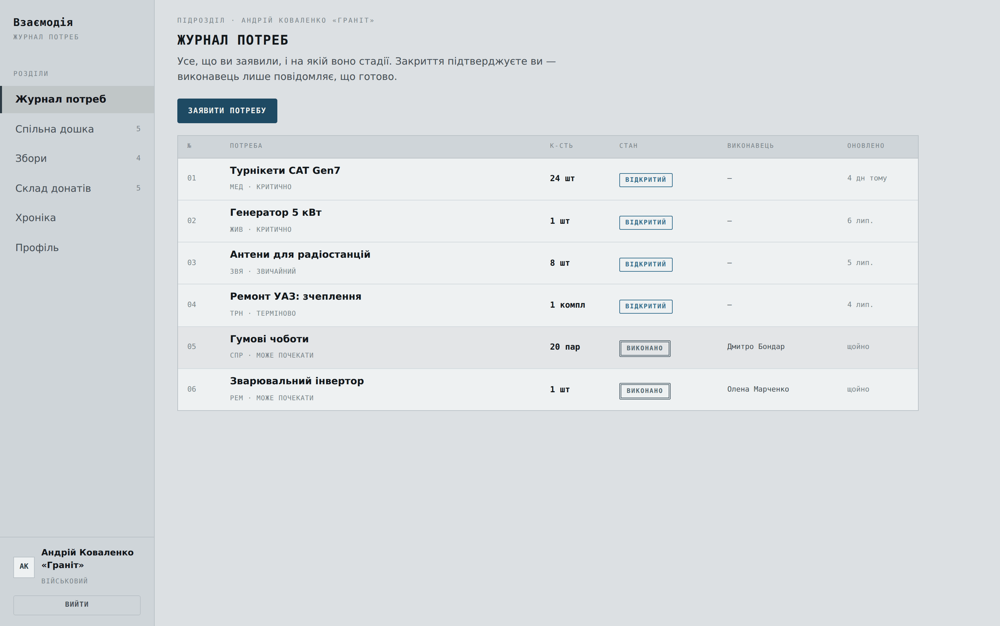
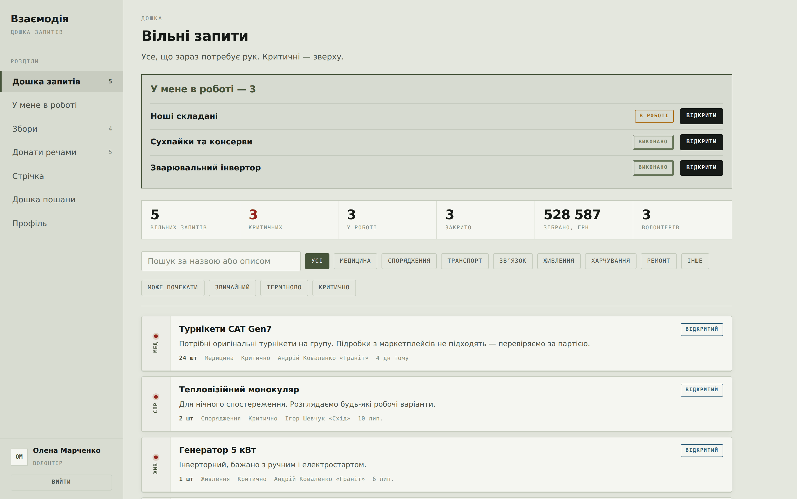
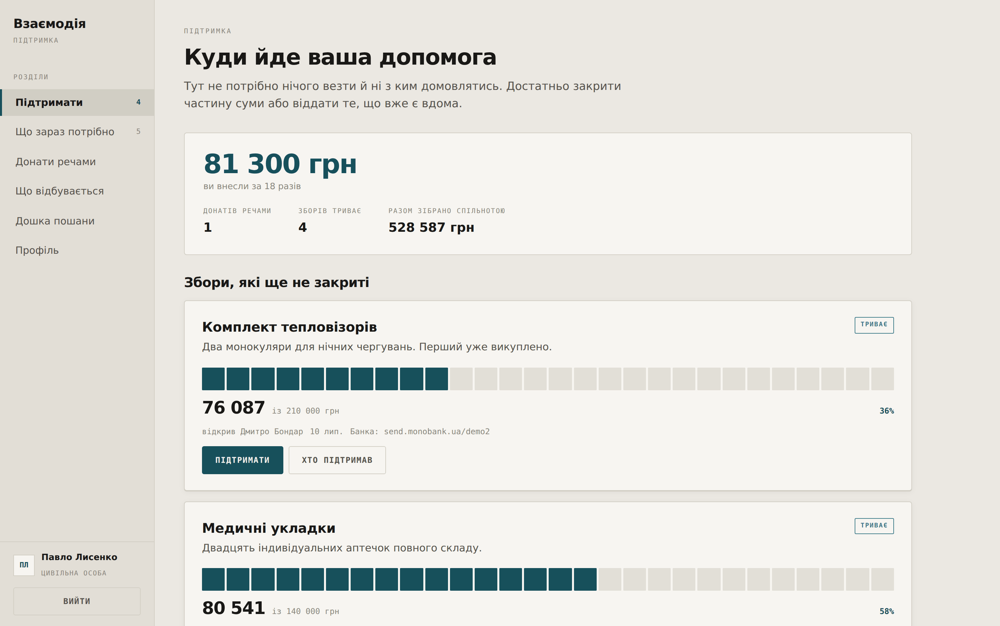

# Взаємодія


Платформа координації між військовими, волонтерами та цивільними: запити на потреби,
фінансові збори, донати речами. Бекенд на FastAPI, веб-клієнт без фреймворка.

Три ролі отримують три різні інтерфейси — не лише різні пункти меню, а різні
головні екрани, щільність і оформлення.

**Військовий — журнал потреб.** Реєстр рядками: що заявлено, у якому стані,
хто виконує. Зверху — те, що чекає його підтвердження.



**Волонтер — дошка запитів.** Черга роботи, критичні зверху. Перед нею видно,
що вже взято на себе.



**Цивільний — підтримка.** Спершу власний підсумок, далі відкриті збори.
Кнопок, якими він не може скористатися, тут немає.



---

## Запуск

Потрібен **Python 3.11+** (використовується `enum.StrEnum`).

```bash
python -m venv .venv && source .venv/bin/activate   # Windows: .venv\Scripts\activate
pip install -r requirements.txt

cp .env.example .env          # і задайте SECRET_KEY
python seed.py                # демо-дані, не обовʼязково
uvicorn app.main:app --reload
```

Інтерфейс — <http://127.0.0.1:8000>, документація API — <http://127.0.0.1:8000/docs>.

Демо-акаунти після `seed.py` (пароль у всіх `demo1234`):

| Логін | Роль | Що може |
|---|---|---|
| `kovalenko`, `shevchuk` | військовий | публікувати запити, підтверджувати виконання, відкривати збори |
| `marchenko`, `bondar`, `tkachuk` | волонтер | брати запити в роботу, відкривати збори, донатити |
| `lysenko`, `hrytsenko` | цивільна особа | підтримувати збори, розміщувати донати речами |

`python seed.py --reset` видаляє базу і наповнює наново. Демо-паролі навмисно
прості — це наповнювач для локального запуску, не приклад для бойового стенду.

### Перед розгортанням

`APP_ENV=production` вмикає перевірку налаштувань: застосунок **відмовиться
стартувати**, якщо `SECRET_KEY` лишився з прикладу або `CORS_ORIGINS` містить
зірочку. Краще впасти на старті, ніж працювати з ключем із репозиторію.

Перевірка наскрізних сценаріїв:

```bash
python smoke_test.py     # 39 перевірок API: права ролей, переходи станів, збори, донати
python ui_test.py        # 24 перевірки інтерфейсу в браузері (потрібен playwright
                         # і запущений сервер на порту 8111)
```

---

## Структура

```
app/
  config.py      налаштування з оточення
  db.py          асинхронний рушій, сесії, створення таблиць
  enums.py       машинні коди довідників + таблиця дозволених переходів
  labels.py      українські підписи до кодів (віддаються через /api/meta)
  models.py      моделі SQLAlchemy 2.0
  schemas.py     схеми запитів і відповідей
  security.py    bcrypt і JWT
  deps.py        поточний користувач, перевірка ролей, журнал подій
  routers/       auth, needs, funds, donations, feed
  main.py        збирання застосунку
static/          веб-клієнт: index.html, styles.css, app.js
seed.py          демонстраційні дані
smoke_test.py    наскрізні перевірки
```

---

## Як влаштовано

**Коди окремо, підписи окремо.** У базі лежить `in_progress`, а не «В роботі».
Людські назви живуть у `labels.py` і віддаються клієнту одним пакетом через
`/api/meta`. Інтерфейс не тримає власних копій, тож переклад не розсинхронізується
з даними, а фільтри не ламаються від зміни мови.

**Стани запиту описані таблицею.** `NEED_TRANSITIONS` в `enums.py` задає, з якого
стану куди можна перейти. Будь-який інший перехід — `409`, а не тихо зіпсовані дані.

```
open ──take──▶ in_progress ──submit──▶ pending ──confirm──▶ completed
  ▲                 │                     │
  └────release──────┘                     └──reject──▶ in_progress
```

Підтверджує виконання **автор запиту**, а не виконавець.

**Права перевіряються на API.** Приховати кнопку в інтерфейсі — не захист.
Залежність `require_roles(...)` стоїть на самих ендпоінтах, тож прямий запит
у обхід клієнта отримає `403`.

**Журнал подій замість готового тексту.** Таблиця `activities` зберігає код події
(`need_taken`) і структуровані дані (`{"title": "..."}`), а рядок для показу
збирає клієнт. Один і той самий журнал працює і стрічкою новин, і історією
конкретного запиту.

**Пошук.** `LIKE` у SQLite нечутливий до регістру лише для латиниці, тож кирилицю
шукаємо по знормалізованій копії тексту (`Need.search_text`), яка оновлюється при
записі. Рішення не залежить від СУБД.

**Збори.** Сума внеску і денормалізоване `current_amount` змінюються в одній
транзакції; при досягненні цілі збір закривається автоматично. Це облік
переказів, а не платіжний шлюз — підключення еквайрингу лишається окремим кроком.

---

## Три інтерфейси

Ролі роблять різну роботу, тож і застосунок у них різний — не лише набором
пунктів меню, а головним екраном, щільністю та оформленням. Тема вмикається
атрибутом `data-role` на `<html>`, який виставляється після входу.

| | Військовий | Волонтер | Цивільний |
|---|---|---|---|
| Головний екран | **Журнал потреб** — реєстр рядками зі станом і виконавцем | **Дошка запитів** — черга карток, критичні зверху | **Підтримати** — збори великим планом і особистий підсумок |
| Головне питання | «на якій стадії те, що я заявив» | «що взяти наступним» | «куди пішли саме мої гроші» |
| Перше, що бачить | блок «потребує вашого підтвердження» | блок «у мене в роботі» | скільки він уже вніс |
| Палітра | графіт | олива | тепла нейтраль і бірюза |
| Заголовки | JetBrains Mono, великими літерами | Unbounded | Onest, великий кегль |
| Щільність | 14.5 px, стиснуті рядки | 15 px, картки | 16 px, повітря |

Цивільний не бачить кнопок, якими не може скористатися: замість дошки з
«Взяти в роботу» в нього огляд потреб за категоріями, звідки веде дія, доступна
саме йому, — віддати річ або закрити частину збору. Маршрути чужих ролей
недоступні: перехід на них повертає користувача на його власний головний екран.

Спільне для всіх трьох: оформлення робочого документа — стенсильні мітки
категорій на кромці картки, стани у вигляді штампів, прогрес збору засічковою
шкалою замість суцільної смуги. Адаптив до 390 px, видимий фокус клавіатури,
`prefers-reduced-motion` враховано.

---

## Що варто зробити далі

- **Alembic** замість `create_all` — щойно зʼявиться друга версія схеми.
- **Refresh-токени.** Зараз один access-токен на тиждень; для мобільного клієнта
  потрібна пара з поновленням.
- **Сповіщення.** Волонтер має дізнаватись про критичний запит одразу, а не
  при наступному відкритті дошки. Найдешевший шлях — телеграм-бот на тому ж API.
- **Модерація.** Зараз будь-хто реєструється будь-якою роллю. Для бойового
  використання потрібне підтвердження ролі «військовий».
- **Пагінація** на дошці та у стрічці — на кількох тисячах записів поточний
  підхід почне гальмувати.
- **Тонкий Kivy-клієнт** поверх цього ж API, якщо повертатись до мобільної версії.

---

## Ліцензія

MIT — див. [LICENSE](LICENSE).
